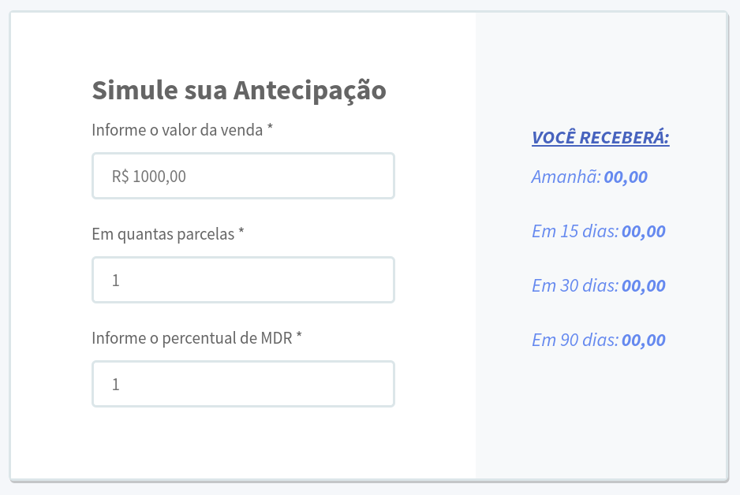

# Front end Challenge 1

[https://front-end-challenge-1-zeta.vercel.app/](https://front-end-challenge-1-zeta.vercel.app/)


<p align="center">
    
</p>

## Requirements

- Node
- Yarn

## Getting start

Install dependencies

```sh
$ yarn install
```

Run project

```sh
$ yarn start
```

Run tests

```sh
$ yarn test
```

## Notes

Small application for calculating MDR values, developed in react for front end challenge 1.